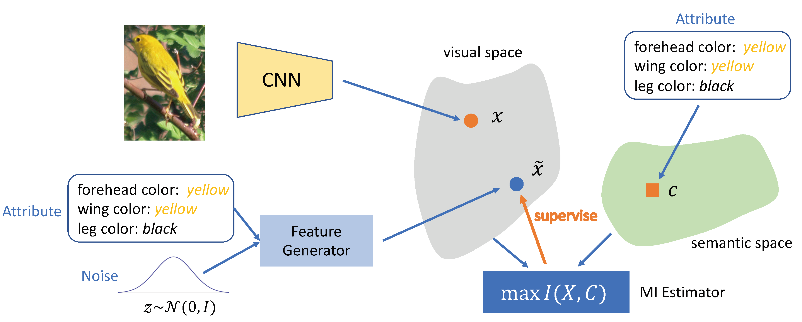
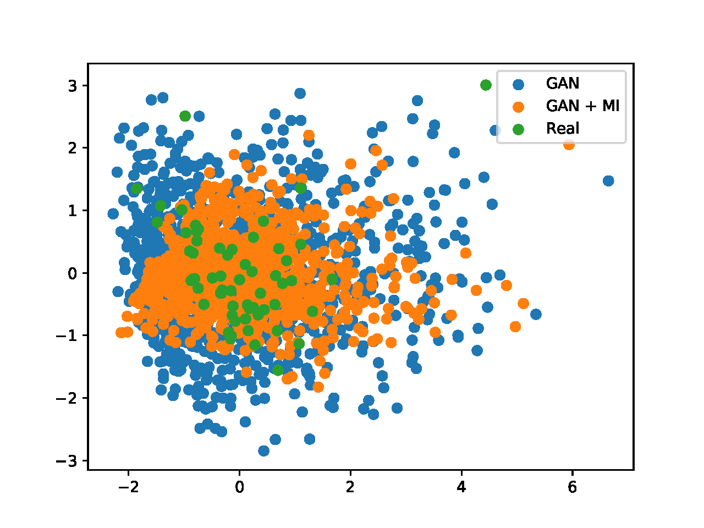
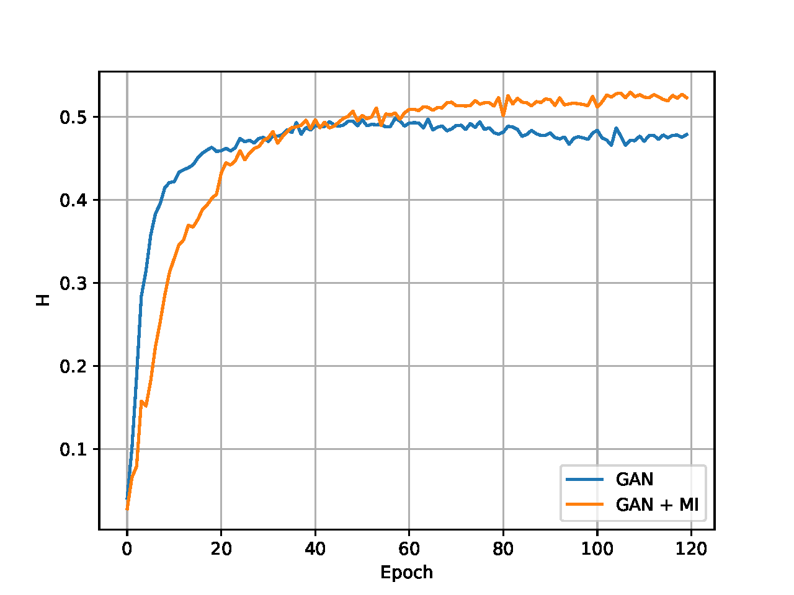

# InfoMax-ZSL
Public repo for paper 'Visual-Semantic Mutual Information Maximization for Generative Zero-Shot Learning'

## Prepare the data
Download the datasets from [http://www.mpi-inf.mpg.de/zsl-benchmark](http://www.mpi-inf.mpg.de/zsl-benchmark)

## Reproduce the results
- Change the path in `main.py` to your path of the datasets
- Run any script in folder `scripts/` to reproduce the results

## Visualization

After changing the path of saved weights of networks and log files, you can visualize the results:

- Run `visualization.py`  to plot the distribution of generated features:

- Run `plot_curve.py` to plot the accuracy curve (for ZSL) and H curve (for GZSL):

  

